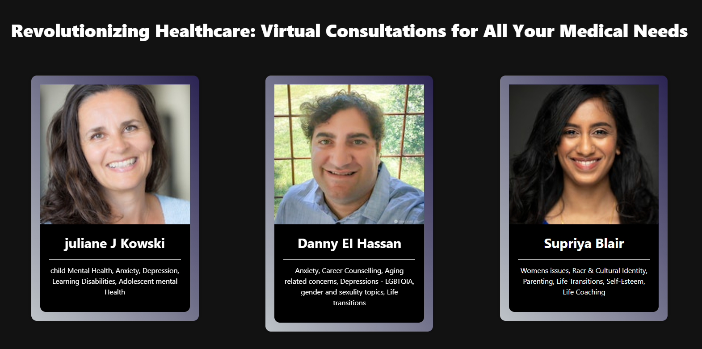
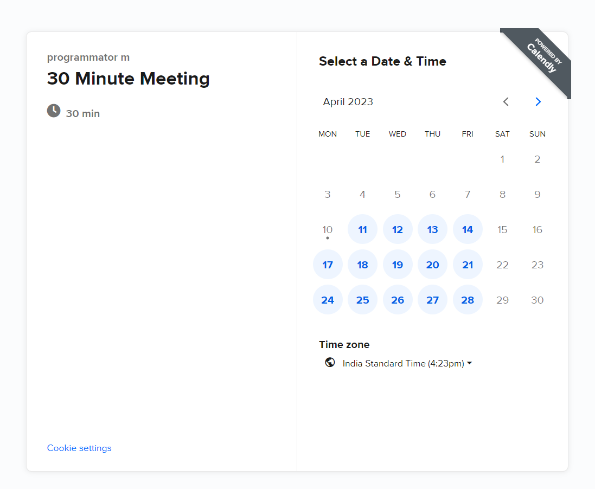

### Melthify

<p>
  Melthify is a comprehensive mental health support system that aims to improve well-being through artificial intelligence and teleconsultation. Our AI-powered chatbot is available 24/7, ready to listen and guide you towards the right resources and support that you need. Additionally, our teleconsultation platform allows you to connect with licensed mental health professionals, ensuring that you get the best possible care.
</p>

```console
cd 'path to melthify app'
```

##To start the web app : 
```console
cd client
npm i
npm run dev
```

Note : open the client website only through localhost. Avoid using ip address

```console
cd app/server
npm i
```
add .env file containing openai API key in the server dir

##To start the server : 
```console
npm start
```


<div>





</div>